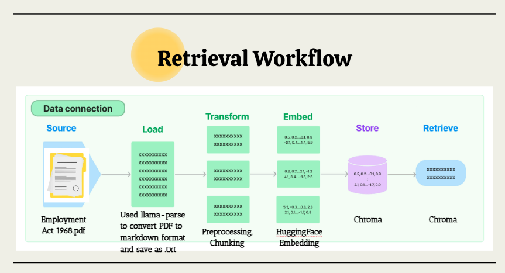
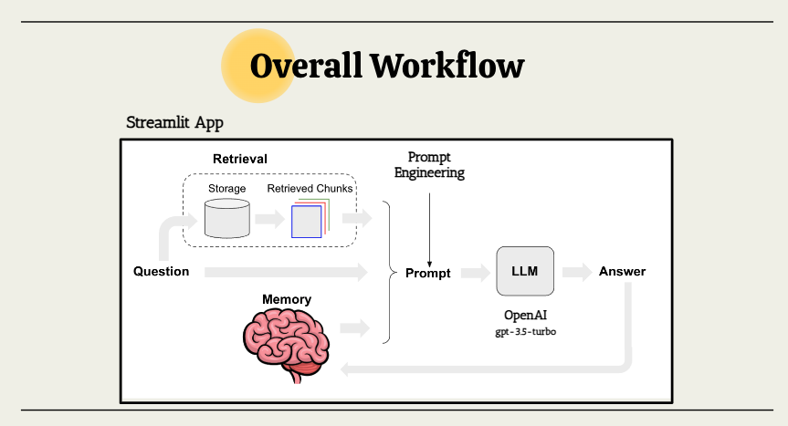

# Hello Bhaiya 👋  
A chatbot for migrant workers to understand their employment rights 

## Problem statement 

Singapore has **1,427,500 migrant workers**, comprising 38% of its labour force ([MOM 2019a](https://www.ilo.org/wcmsp5/groups/public/---asia/---ro-bangkok/documents/briefingnote/wcms_766633.pdf)).
According to [Transient Workers Count Too (TWC2)](https://twc2.org.sg/who-we-are/cause/), migrant workers are commonly exploited by employers (i.e. unpaid salaries, illegal wage deductions etc.) and are **disadvantaged by factors such as language** and cultural displacement etc. It is important that migrant workers are aware of their employment rights so that they  may seek the appropriate legal recourse. 
While there is information online, many articles are not easily understood with limited english proficiency. Additionally, workers may also not have enough time to read through long documents to find a relevant clause to their situation.

## Our solution 

Integrate a chatbot with a (Retrieval-Augmented Generation) RAG model that uses the [Employment Act 1968](https://sso.agc.gov.sg/Act/EmA1968) content indexed in its retrieval database; together with prompt engineering, enabling the chatbot to provide detailed answers to questions about the Act in an easily comprehensible manner.

## Tech stack
- LangChain
- OpenAI/ AzureOpenAI
- Llama-parse
- Gitlab
- Streamlit
- Chromadb 

## Workflow

## Challenges

1. Working with a legal document
    - Singapore Employment Act: Well-structured, consistent formatting
    - Each section covers a “topic”
    - How to chunk and retain the structure of the document:
        - We converted the Employment Act PDF into markdown format using Llama-parse
        - Removed the repetitive headers in the document
        - Use LangChain’s RecursiveCharacterTextSplitter where separators=['(?<=\n)##', '(?<=\n)###'] to chunk by sections (topics).

2. Curveball: Azure OpenAI tokens not available

| Tradeoff analysis | Purchase OpenAI tokens | Deploy Mistral-7B-v0.1 on local machine |
|---|---|---|
| Cost | For occasional or small-scale usage, purchasing tokens may be more cost-effective than deploying and managing infrastructure locally. For larger-scale usage, the cost of purchasing tokens may become significant compared to deploying and running models locally. | F.O.C, however, deploying and managing Mistral-7B-v0.1 on a local machine requires more technical expertise and resources for maintenance  |
| Scalability | OpenAI tokens offer scalability, allowing users to access more powerful models and APIs as needed without the hassle of managing hardware. | Local deployment may have scalability limitations compared to cloud-based solutions, especially for resource-intensive models or high-concurrency scenarios. |
| Learning Curve | Purchasing OpenAI tokens allows easy access to pre-trained models and APIs without the need for managing infrastructure. | Initial setup may involve configuring hardware, software dependencies, and model deployment frameworks, which can be time-consuming and complex. |

## Limitations & Future Work

- Currently input and outputs are in English only -> Add translation for both inputs from user and outputs to user if other languages are used
- Requires access to API key for ChatGPT3.5

## Setup

### conda environment 

Create the required environment: `conda env create --file=conda.yml`

### create a .env file with the following params

openai_api_key = #your token here
filepath=data/employment_act_markdown.txt
deployment_name_model=gpt-35-turbo-0613
deployment_name_text_embedding=text-embedding-ada-002

#### run chatbot 

To run the chatbot locally: `streamlit run src/hellobaya.py`

#### run chatbot using Docker 

i. Build docker: docker build -t hello-baya:v1 . 
ii. Run docker: docker run --rm -it -p 8501:8501 hello-baya:v1
